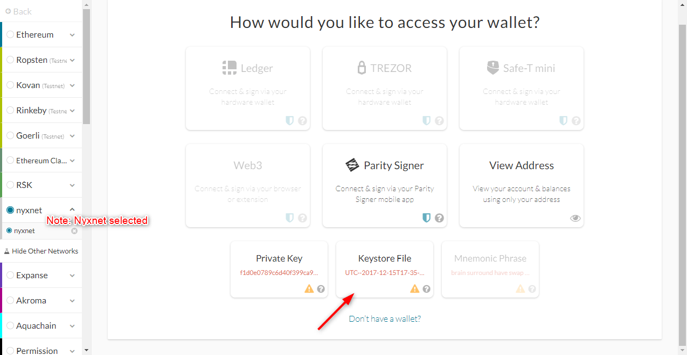

# Proof of Authority Development Chain

As described in the primary README at the "top" of this repository (found [here](../README.md) in case you're lost) this document is a demonstration of the setup and testing of a development blockchain with its own "testnet" or internal network, along with some test transactions.

---

## Intro and Manifest

### Intro

So, you've pulled this repo and want to experiment with this particular blockchain.  Some things to note before starting.  This particular blockchain consensus algorith config is that of Proof of Authority (PoA) as opposed to other types of consensus, e.g. Proof of Work.  In this demo, one would need to set up ones own network, which I will show below for which  private and public keys are provided!

Note:  This is ***never*** done in practice, but as this is a private network with a test chain, the required security with requisite keys (forming the basis of Proof of Authority) have been provided, but are utterly useless external to this experiment/demo.

### Manifest

The folders as part of this repo are: -
- `./Screenshots`: a folder of images, to which the instructions below reference.
- `./nyxnet`: the main folder with all required files for firing up the chain.
  - `node1`: the set of files for primary node (node1) of the chain (as demonstrated)
    - these include the private keys and chain data
  - `node2`: the set of files for the secondary node (node2) of the chain
    - as node1
  - `nyxnet.json`: the main file which holds the network configuration, required to start the network
  - `nyxnet-node1.log` and `nyxnet-node2.log` which show the starting up of the chain and subsequent transaction.  Useful if you'd like to "dig a little deeper".

### Downloading Go Ethereum

Download the Go Ethereum Tools for your OS at https://geth.ethereum.org/downloads/

> NOTE: For this demo, install "Geth & Tools 1.9.7" as I know it works.  Feel to download others, but then I can't guarantee it will work

Unpack the zip file that is downloaded and extract wherever comfortable.  Perhaps the best would be a folder within `poa-development-chain` called `blockchain-tools`.  This folder should be where the files are unpacked and not where the zipped folder is unpacked; I hope that makes sense.

## Starting up the node

### Understanding the required parts

A brief explanation of the constituent parts is required before starting.  Any chain is highly dependent on being secure and operating with relevant public/private key pairs.

Furthermore the chain requires that a network is set up for it to commuinicate across.  This configuration is laid out below and used when starting the nodes up.  A tool by the name of `puppeth` is used to create the network.

**Network config**:
- *nyxnet*: this is the name of the network
- *778*: this is the port number reserved for the network

> Note:  
> These are found within `nyxnet.json` and referenced upon startup, so won't need to be "memorised", e.g.: -  
>  
>   

**Security Config**:
- Node 1
  - password: nyxnet1
  - private key: 45a5ca3df1396311b53d5c00454aeab8b3d8c3c5
  - public address: 0x45a5cA3DF1396311b53d5C00454aeaB8B3D8c3c5
  - keystore location: `~\blockchain-homework\poa-development-chain\nyxnet\node1\keystore`
- Node 2
  - password: nyxnet2
  - private key: 3e8d12e6fddd4477a43af146b845e3cf95f20e07
  - public address: 0x3E8D12e6fDdD4477a43af146b845e3cf95f20e07
  - keystore location: `~\blockchain-homework\poa-development-chain\nyxnet\node2\keystore`

### Firing up the nodes 

**Node 1**

To start up the chain, one needs to navigate to the folder where the Ethereum tools are, in this case `poa-development-chain/blockchain-tools`

To start the primary node, i.e. node1, perform the following: -

`./geth --datadir ../nyxnet/node1 --unlock "45a5ca3df1396311b53d5c00454aeab8b3d8c3c5" --mine --rpc --allow-insecure-unlock`

 > Note:  
 > `--datadir` is the location of the node chain data  
 > `--unlock` unlocks the chain using the private key (with the use of `--allow-insecure-unlock` for plain text password use)  
 > `--mine` is for the node to start mining  
 > `--rpc` is for the node to use remote procedure calls to the configured port (instructions later)  

A password will be prompted for; type in the password for `node1`.  Once the mining has started, navigate to the first twenty or so lines of the output and find the reference to `enode://<DISCOVERY BOOTSTRAP ADDRESS>@127...`.  Take note of this address and use it in the starting up of `node2`.

**Node 2**

To start a subsequent node, e.g. node2, perform the following: -

`./geth --datadir ../nyxnet/node2 --unlock "3e8d12e6fddd4477a43af146b845e3cf95f20e07" --mine --port 30304 --bootnodes "enode://<ENODE ADDRESS FROM NODE 1>@127.0.0.1:30303" --ipcdisable --allow-insecure-unlock`

 > Note:  
 > All relevant switches preformed for node1 will be relevant, but change them for this node as the values *won't be the same*  
 > `--port 30304` this port number is one that follows that of the default of 30303 for the primary node; the safest is to use 30304  
 > `--bootnodes "enode://<address-from-instructions-above>@127.0.0.1:30303"` this is the enode URL required for this node to discover the primary node (and by extention any other connected nodes).  The address must be changed to that which is generated from the start of node1. If there are other known nodes, the enode list can be a comma separated list of values  
 > `--ipcdisable` disables the ipc-rpc server and is required if this demo is being executed on Windows  

## Testing Transactions

Okay, so you've started both nodes successfully!  Now you want to connect your wallet to the network to start sending test transactions.  

As this is a test and not for connecting any legitimate networks, the use of "MyCrypto" wallet manager should suffice.  Find out more and download the Desktop App at https://download.mycrypto.com/.  

If you have your own wallet capable of connecting to local RPC-enabled networks, then great; use that instead.

To send a test transaction, we need to accomplish 3 things (shown below): -
- configure wallet for connecting to NyxNet
- connect your wallet to the network
- send the transaction(s)

### Configure Wallet to connect to local Test Network

In order to connect your wallet to the custom network (or node), start it up and using *MyCrypto* as an example, click on `+ Add Custom Node`.  

  

You'll see the following pop-up for setting up the configuration.  Populate all as is seen in this example, paying specific attention to the Network being `Custom`, the Chain ID being `778` and the URL being `http://127.0.0.1:8545` noting that it is not http**s**, then click `Save & Use Custom Node`.

  

You'll be directed back to the main page.  On the left "Network" panel, click `Connect to Network` and select the new NyxNet set up.

  

You should now be connected without issue.  If not, check that the Chain ID, the RPC port and IP address are correct.

### Connect your Wallet to the Primary Node

Note, you will now be connected to NyxNet.  It is now time to conenct your Wallet to the test-chain and in order to do that, one has to connect using privileged credentials.

To connect, select to connect using `Keystore File`.

  

A file selection window will pop open; navigate to the location of the file within the keystore (see above config if you're not sure where that is).  

Select the file.

  

Another prompt will open up and require the password to the keystore.  Again, the password is in the config above.  As this is the *primary* node you're connecting to, ensure it is the Node 1 password you're using.

  

Your Wallet will now be connected to the Node 1 address.  As can be seen, the address matches that of the config (as shown above) and you will be able to send a test transaction to the address of Node 2 next.

### Send test transaction!!

X

  

X  

  

X  

  

X  

### Hooray, you're done!

Was that fun?  I hope so :)

## Acknowledgements and References

- All software used in the creation of this demonstration and the setup of the blockchain has been provided by the Ethereum Foundation ([ethereum.org](https://ethereum.org/))
- Trinity College is the organisation that has provided training for accomplishing this demo (as part of a Monash University Bootcamp)
